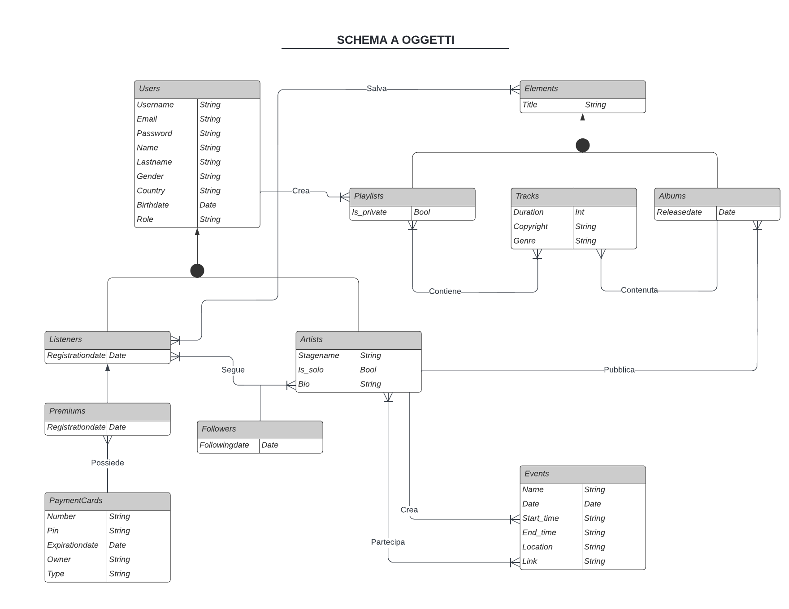
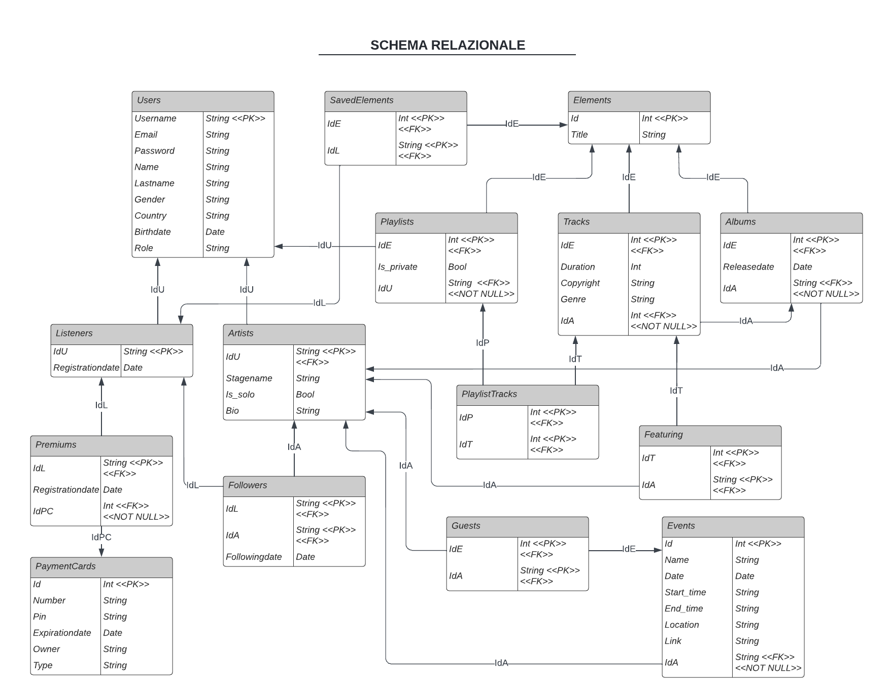

# MusicProject

Web app having music artists, which can upload songs, albums...,
and listeners, which can like artists' items.

### Made With
* Python
* Flask
* SQLAlchemy
* PostgreSQL
* Jinja
* HTML/CSS/JavaScript
* Bootstrap

### Demo

    <h4>Listener Demo</h4>
    
    <h4>Artist Demo</h4>
    

### DB Schema

    <h4>Object Diagram</h4>
    
    <h4>ER Diagram</h4>
    

